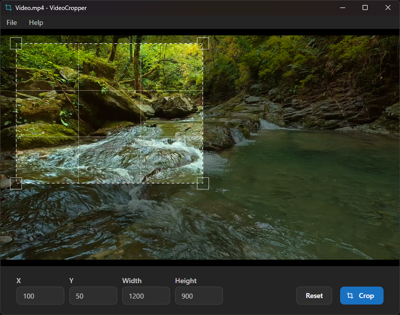

<div align="center">
  
  <br />
  <h1 align="center">VideoCropper</h1>
</div>

VideoCropper is a desktop app that allows you to crop videos.

**Requires [FFmpeg](https://www.ffmpeg.org).**

## Screenshot


## Development

### Prerequisites

- Node.js 24+
- pnpm 11+
- Rust 1.97+
- [System dependencies for Tauri](https://tauri.app/start/prerequisites/#system-dependencies)

### Build from Source

```bash
# Clone the repository
git clone https://github.com/stuartstew/video-cropper.git
cd video-cropper

# Install dependencies
pnpm install

# Run in development
pnpm tauri dev

# Build for production
pnpm tauri build
```

## Credits

- Icon: "crop" by [Phosphor Icons](https://phosphoricons.com) - MIT License
